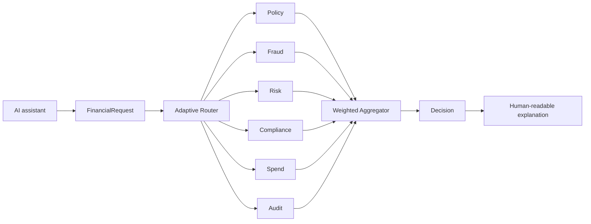

<div align="center">



### Policy-first governance for high-stakes AI decisions

<p>
  
  
  
  
</p>

<p>
  <a href="#-the-idea">The idea</a> ·
  <a href="#-architecture">Architecture</a> ·
  <a href="#-quick-start">Quick start</a> ·
  <a href="#-roadmap">Roadmap</a>
</p>


</div>

<br />

> **SentinelAI** is an architecture-first Python project for governing financial requests through independent policy, fraud, risk, compliance, spending, and audit domains before a final decision is produced.

<div align="center">

`request` → `route` → `evaluate` → `aggregate` → `explain`

</div>

## ✦ The idea

An LLM can understand a request. It should not be the only thing deciding whether a financial action is safe.

SentinelAI is designed as a **governance boundary** between an AI assistant and a consequential operation. A structured request can be routed to several focused experts, combined into one decision, and returned with reasoning that a person can inspect.

```text
 AI assistant  ──►  structured request  ──►  SentinelAI  ──►  decision + reasoning
                                                     │
                           policy · fraud · risk · compliance · spend · audit
```

## ⚡ What is here today

| Area | Current state |
| --- | --- |
| Typed request and decision contracts | ✅ Pydantic schemas and enums |
| Governance domains | ✅ Base interfaces and package layout |
| External configuration | ✅ JSON rule sets for six domains |
| Example scenarios | ✅ Refund, travel, card, and malicious request fixtures |
| Router, experts, aggregator, explainer | 🧪 Scaffolded for implementation |
| CLI/API entry point and automated behavior tests | 🚧 Next build stage |

## 🧭 Architecture



### The six governance lenses

- **Policy** — business rules, thresholds, and permitted actions.
- **Fraud** — suspicious signals such as unusual devices or high-value activity.
- **Risk** — exposure and amount-based risk levels.
- **Compliance** — KYC, AML, and regulatory constraints.
- **Spend** — budget and spending-pattern guardrails.
- **Audit** — decision traceability and review context.

Each domain has its own JSON rule set under [`rules/`](rules/). That keeps policy changes reviewable and separate from Python orchestration code.

## 🧱 Repository map

```text
sentinel-ai/
├── models/
│   ├── base/          # Expert, router, aggregator, and explainer contracts
│   ├── experts/       # Governance-domain modules
│   ├── router/        # Request routing strategy
│   ├── aggregator/   # Cross-expert decision aggregation
│   ├── explainer/    # Explanation layer
│   └── governor/     # Top-level SentinelAI orchestration
├── schemas/           # Pydantic request, response, decision, and enum types
├── rules/             # Versioned JSON policy configuration
├── simulations/       # Example request fixtures
├── tests/             # Test package
├── requirements.txt
└── run.py             # Future application entry point
```

## 🚀 Quick start

```bash
git clone <https://github.com/MaheshReddy-ML/SentinelAI>
cd sentinel-ai

python3 -m venv .venv
source .venv/bin/activate
python -m pip install --upgrade pip
python -m pip install -r requirements.txt
```

Validate the typed contracts directly:

```bash
python - <<'PY'
from schemas.request import FinancialRequest

print(FinancialRequest.model_json_schema())
PY
```

> The orchestration entry point is intentionally still under construction; `run.py` is reserved for the upcoming executable workflow.

## 📜 Rule sets

Rules are JSON documents with metadata, priorities, conditions, outcomes, confidence, and a human-readable reason. A typical rule expresses intent like this:

```json
{
  "rule_id": "POL-001",
  "action": "refund",
  "conditions": { "max_amount": 20000 },
  "decision": "approve",
  "confidence": 0.99,
  "reason": "Refund amount is within the automatic approval threshold."
}
```

This makes governance configuration easy to diff, review, version, and replace per environment.

## 🗺️ Roadmap

- [x] Define request, expert-output, and decision contracts
- [x] Establish modular governance package boundaries
- [x] Add domain-specific JSON rule sets
- [x] Add representative simulation fixtures
- [ ] Implement rule loading and condition evaluation
- [ ] Implement the six expert engines
- [ ] Connect routing, aggregation, and explanation flow
- [ ] Add executable CLI and behavior-focused tests
- [ ] Add REST API, observability, and deployment packaging

## 🤝 Contributing

Issues, rule ideas, schema improvements, and expert implementations are welcome. Keep changes small and reviewable, add or update fixtures when behavior changes, and avoid embedding organization policy directly in orchestration code.

## ⚖️ Project note

SentinelAI is an active development project and is **not production-ready**. Its rule files are demonstration configurations, not financial, legal, compliance, or investment advice. Validate all governance behavior with qualified domain experts before using it with real decisions.

<div align="center">

<br />

**Built for AI systems that need guardrails, not guesswork.**

</div>
