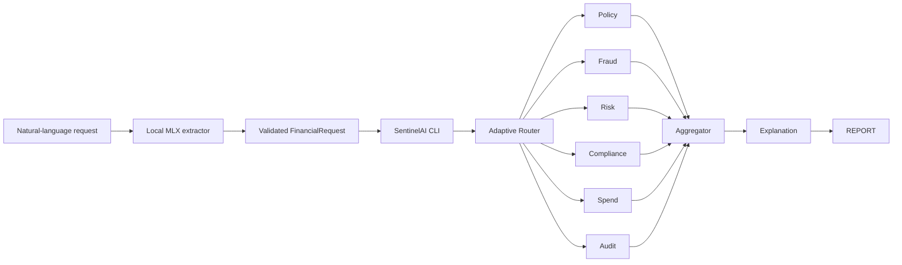

<div align="center">


<a href="#-run-the-cli"></a>


<p>
  <a href="#-run-the-cli">Run CLI</a> ·
  <a href="#-what-is-live">What is live</a> ·
  <a href="#-architecture">Architecture</a> ·
  <a href="#-decision-traceability">Decision traceability</a>
</p>


</div>

<br />

> **SentinelAI** is an active financial-AI governance project. A local MLX model extracts a typed request; JSON rules and deterministic expert aggregation make every governance decision.

```text
 natural language  ──►  local MLX extractor  ──►  Pydantic request  ──►  rule-driven governance report
```

## ⚡ Run the CLI

The CLI supports a local Apple-Silicon LLM for request extraction and then evaluates the request with JSON governance rules. The LLM never makes a governance decision.

```bash
git clone https://github.com/MaheshReddy-ML/SentinelAI.git
cd SentinelAI

python3 -m venv .venv
source .venv/bin/activate
python -m pip install --upgrade pip
python -m pip install -e .
```

### Analyze a sample request

```bash
sentinel analyze simulations/sample.json
```

### Analyze natural language locally

```bash
python scripts/setup_local_llm.py
# Use single quotes in zsh: double quotes expand $1250 before SentinelAI receives it.
sentinel analyze --prompt 'Book a business flight to New York tomorrow for $1250 using my corporate card.'
```

See [local model setup](LOCAL_LLM.md) for the selected MLX model, fallback, and machine-measured benchmark command.

### Start interactive mode

```bash
sentinel analyze
```

Interactive mode accepts a natural-language request. If an approval-critical fact such as amount is missing, SentinelAI asks a focused clarification instead of inventing a value.

### If `sentinel` is not found

The executable exists only inside the activated virtual environment. Run:

```bash
source .venv/bin/activate
sentinel analyze simulations/sample.json
```

Or skip activation entirely:

```bash
.venv/bin/python run.py analyze simulations/sample.json
```

## ✨ What the terminal experience delivers

```text
SENTINELAI // Adaptive Governance Platform

● Extracting validated request       ● Running Compliance Expert
● Loading governance rules           ● Running Spend Expert
● Routing experts                    ● Running Audit Expert
● Running Policy / Fraud / Risk      ● Aggregating results

──────────────── SentinelAI Governance Report ────────────────
 AI Understanding  ·  Request Summary  ·  Expert Results
 Matched rule IDs  ·  Final Decision  ·  Runtime metrics
```

The UI remains isolated in [`cli/`](cli/). It builds a request, calls `analyze_transaction(request)`, and renders the returned result. `models/llm/` is restricted to local natural-language extraction; [`cli/mock_engine.py`](cli/mock_engine.py) invokes deterministic rule experts and aggregates their results.

## 🟢 What is live

| Surface | State | Notes |
| --- | :---: | --- |
| Typed request, decision, and expert contracts | ✅ | Pydantic models in [`schemas/`](schemas/) |
| Governance-domain layout | ✅ | Policy, fraud, risk, compliance, spend, and audit boundaries |
| Versioned rule documents | ✅ | JSON configurations in [`rules/`](rules/) |
| Rich terminal interface | ✅ | Natural language, focused clarifications, live stages, panels, and metrics |
| CLI packaging | ✅ | `sentinel analyze` after `pip install -e .` |
| CLI behavior tests | ✅ | Focused tests for sample loading and report rendering |
| Rule loading and condition evaluation | ✅ | Validated JSON rules evaluated against typed requests |
| Local request extraction | ✅ | MLX adapter with JSON validation and one retry |
| Expert execution and deterministic aggregation | ✅ | Policy, fraud, risk, compliance, spend, and audit reports with rule traceability |
| API, observability, and deployment | ⏳ | Future delivery track |

## 🧭 Architecture



The local model only extracts request data. Rule documents and experts remain the sole governance decision path.

## 🧱 Repository map

```text
sentinel-ai/
├── cli/                 # Presentation layer: prompts, progress, display, theme, adapter
├── schemas/             # Pydantic request, decision, and expert-output contracts
├── models/              # Engine interfaces and future governance components
├── rules/               # Versioned policy, fraud, risk, compliance, spend, audit JSON
├── simulations/         # JSON examples, including sample.json for the CLI
├── tests/               # CLI behavior coverage
├── pyproject.toml       # Installable `sentinel` command
└── run.py               # Direct project entry point
```

## 🔎 Decision traceability

Each report includes an **AI Understanding** panel (explicit facts, missing facts, and timings), then one row per expert with matched rule IDs, decision, confidence, and execution time. The final decision is derived from the deterministic expert outputs; the local model never approves, blocks, reviews, or scores a request.

When no policy exists for an action, the relevant expert returns an intentional `REVIEW` with an undefined-policy explanation rather than a generic pass.

## 🔐 Governance lenses

| Lens | Intended responsibility |
| --- | --- |
| Policy | Business rules, thresholds, and allowed actions |
| Fraud | Suspicious activity and anomalous request signals |
| Risk | Exposure and amount-based risk signals |
| Compliance | KYC, AML, and regulatory constraints |
| Spend | Budget and spending-pattern guardrails |
| Audit | Traceability and review context |

## 🛠️ Development checks

```bash
source .venv/bin/activate
python -m pytest -q
python -m compileall cli models schemas utils tests
```

## ⚖️ Project status

SentinelAI is a hackathon/demo governance platform, not financial, legal, compliance, or investment advice. Its rule documents are illustrative controls and must be reviewed, versioned, and approved by the institution before any real transaction use.

<div align="center">

<sub>Built for systems that need guardrails, not guesswork.</sub>

</div>
