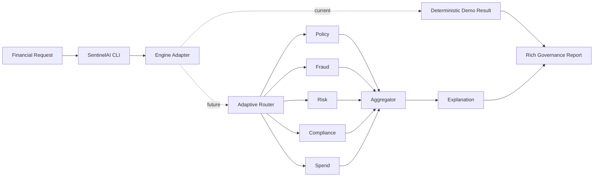
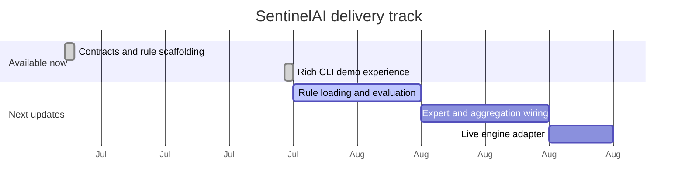

<div align="center">


<a href="#-run-the-cli"></a>


<p>
  <a href="#-run-the-cli">Run CLI</a> ·
  <a href="#-what-is-live">What is live</a> ·
  <a href="#-architecture">Architecture</a> ·
  <a href="#-delivery-radar">Delivery radar</a>
</p>


</div>

<br />

> **SentinelAI** is an active financial-AI governance project. Today it provides typed contracts, rule-set scaffolding, and a polished terminal report experience. Its live governance engine is deliberately still being built.

```text
 request  ──►  SentinelAI CLI  ──►  governance report
                  │
                  └── demo adapter today · real engine integration next
```

## ⚡ Run the CLI

The CLI is ready to explore now. It renders a deterministic demonstration report; it **does not yet evaluate policy, fraud, risk, compliance, or spend rules**.

```bash
git clone https://github.com/MaheshReddy-ML/SentinelAI.git
cd SentinelAI

python3 -m venv .venv
source .venv/bin/activate
python -m pip install --upgrade pip
python -m pip install -e .
```

### Analyze a sample request

```bash
sentinel analyze simulations/sample.json
```

### Start interactive mode

```bash
sentinel analyze
```

Interactive mode collects amount, currency, merchant, category, country, payment method, timestamp, and an optional user ID.

### If `sentinel` is not found

The executable exists only inside the activated virtual environment. Run:

```bash
source .venv/bin/activate
sentinel analyze simulations/sample.json
```

Or skip activation entirely:

```bash
.venv/bin/python run.py analyze simulations/sample.json
```

## ✨ What the terminal experience delivers

```text
SENTINELAI // Adaptive Governance Platform

✓ Validating request                 ✓ Running Compliance Expert
✓ Loading governance rules           ✓ Running Spend Expert
✓ Routing experts                    ✓ Aggregating results
✓ Running Policy / Fraud / Risk      ✓ Generating explanation

──────────────── SentinelAI Governance Report ────────────────
 Request Summary  ·  Expert Results  ·  Final Decision
 Explanation      ·  Runtime / confidence metrics
```

The UI is intentionally isolated in [`cli/`](cli/). It only builds a request, calls `analyze_transaction(request)`, and beautifully renders the returned result. The current implementation of that function lives in [`cli/mock_engine.py`](cli/mock_engine.py) and is a safe, deterministic adapter that can be replaced when the real engine lands.

## 🟢 What is live

| Surface | State | Notes |
| --- | :---: | --- |
| Typed request, decision, and expert contracts | ✅ | Pydantic models in [`schemas/`](schemas/) |
| Governance-domain layout | ✅ | Policy, fraud, risk, compliance, spend, and audit boundaries |
| Versioned rule documents | ✅ | JSON configurations in [`rules/`](rules/) |
| Rich terminal interface | ✅ | Interactive and JSON-file flows, report tables, panels, and metrics |
| CLI packaging | ✅ | `sentinel analyze` after `pip install -e .` |
| CLI behavior tests | ✅ | Focused tests for sample loading and report rendering |
| Rule loading and condition evaluation | 🛠️ | Engine work is in progress; it is not connected to the CLI |
| Expert execution, routing, aggregation, and live explanation | ⏳ | Next engine-integration track |
| API, observability, and deployment | ⏳ | Future delivery track |

## 🧭 Architecture



The dashed path is the current, intentionally non-governing demo mode. The solid engine path is the architecture SentinelAI is being built to support.

## 🧱 Repository map

```text
sentinel-ai/
├── cli/                 # Presentation layer: prompts, progress, display, theme, adapter
├── schemas/             # Pydantic request, decision, and expert-output contracts
├── models/              # Engine interfaces and future governance components
├── rules/               # Versioned policy, fraud, risk, compliance, spend, audit JSON
├── simulations/         # JSON examples, including sample.json for the CLI
├── tests/               # CLI behavior coverage
├── pyproject.toml       # Installable `sentinel` command
└── run.py               # Direct project entry point
```

## 📡 Delivery radar



Dates in the radar are visual sequencing, not delivery promises. Updates will progressively replace the demo adapter while preserving the same CLI command and report layout.

## 🔐 Governance lenses

| Lens | Intended responsibility |
| --- | --- |
| Policy | Business rules, thresholds, and allowed actions |
| Fraud | Suspicious activity and anomalous request signals |
| Risk | Exposure and amount-based risk signals |
| Compliance | KYC, AML, and regulatory constraints |
| Spend | Budget and spending-pattern guardrails |
| Audit | Traceability and review context |

## 🛠️ Development checks

```bash
source .venv/bin/activate
python -m pytest -q
python -m compileall cli schemas tests
```

## ⚖️ Project status

SentinelAI is **not production-ready**. Rule files and the current CLI report are demonstration material, not financial, legal, compliance, or investment advice. Do not use the current mock output to approve, block, or review real transactions.

<div align="center">

<sub>Built for systems that need guardrails, not guesswork.</sub>

</div>
